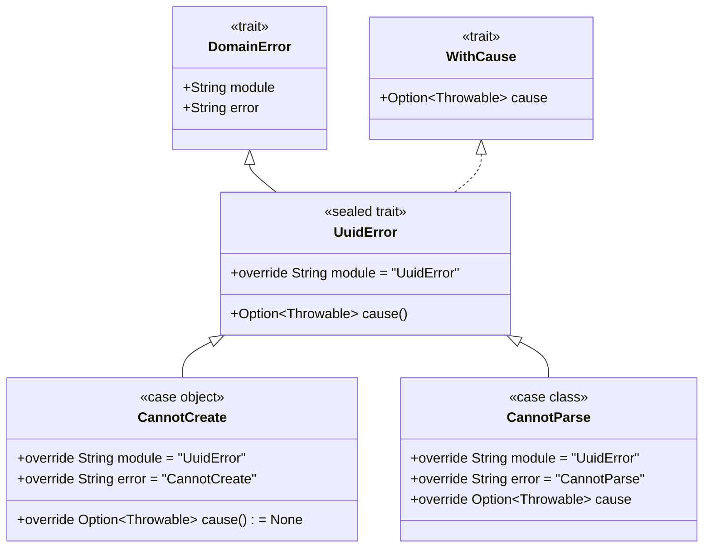

## ToDo with Scala 3, ZIO, and Cardano Blockchain

### API

| Method | Path        | Description    |
|--------|-------------|----------------|
| GET    | /tasks      | Get all tasks  |
| GET    | /tasks/{id} | Get task by id |
| POST   | /tasks      | Create task    |
| PUT    | /tasks/{id} | Update task    |
| DELETE | /tasks/{id} | Delete task    |

### Internal Error Handling Example

