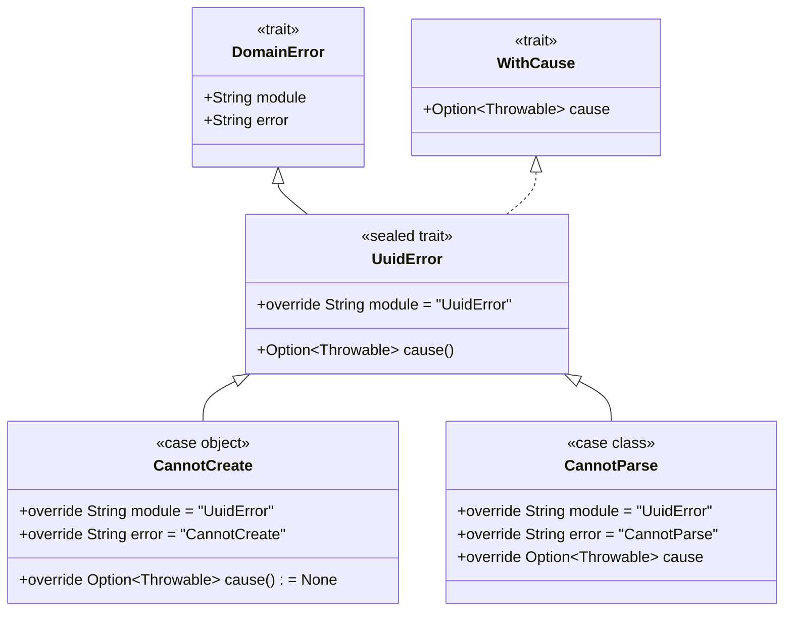

## ToDo with Scala 3, ZIO, and Cardano Blockchain

### API

| Method | Path        | Description              |
|--------|-------------|--------------------------|
| GET    | /uuid       | Get UUID Id              |
| GET    | /cardano    | Get Cardano generated Id |

### Internal Error Handling Example

